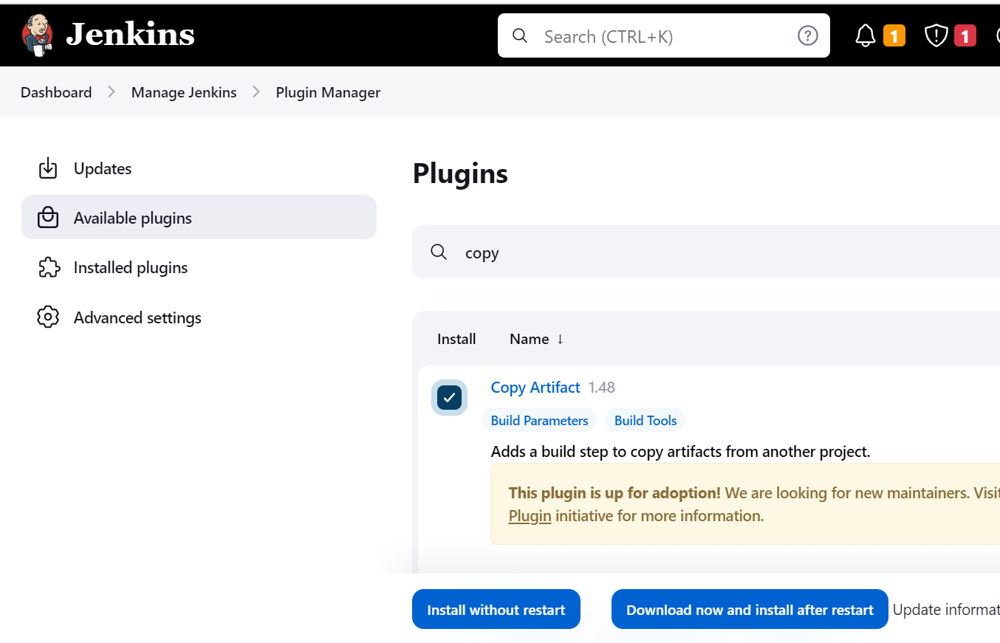
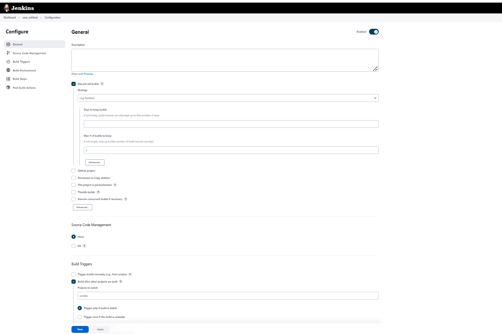
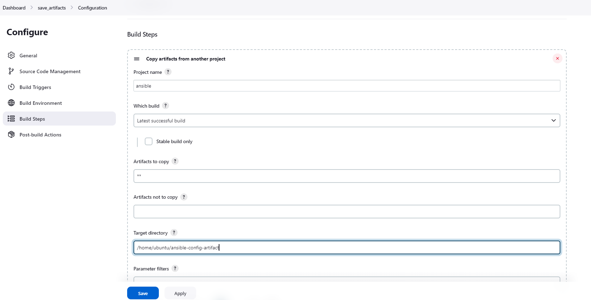
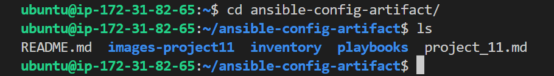
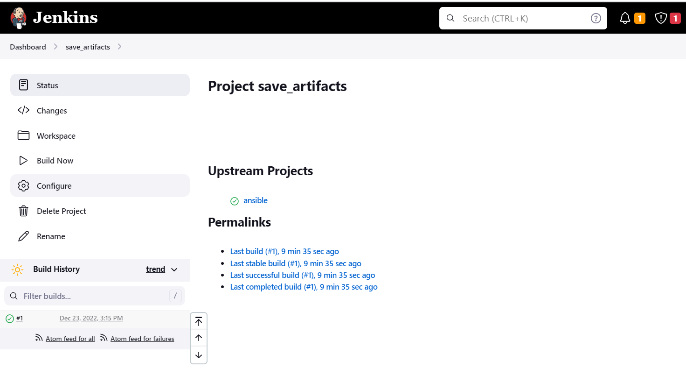

## **ANSIBLE REFACTORING AND STATIC ASSIGNMENTS (IMPORTS AND ROLES)**

 

**Step 1 – Jenkins job enhancement**

Before we begin, let us make some changes to our Jenkins job – now every new change in the codes creates a separate directory which is not very convenient when we want to run some commands from one place. Besides, it consumes space on Jenkins serves with each subsequent change. Let us enhance it by introducing a new `Jenkins project/job` – we will require `Copy Artifact plugin`.

1. Go to your `Jenkins-Ansible server` and create a new directory called `ansible-config-artifact` – we will store there all artifacts after each build.

`sudo mkdir /home/ubuntu/ansible-config-artifact`

2. Change permissions to this directory, so Jenkins could save files there.

 `chmod -R 0777 /home/ubuntu/ansible-config-artifact`

3. Go to Jenkins web console -> Manage Jenkins -> Manage Plugins -> on Available tab search for `Copy Artifact` and install this plugin without restarting Jenkins

4. Create a new Freestyle project (you have done it in Project 9) and name it `save_artifacts`.

5. This project will be ``triggered` by `completion of your existing ansible project`. Configure it accordingly:
   

Note: You can configure number of builds to keep in order to save space on the server, for example, you might want to keep only last 2 or 5 build results. You can also make this change to your ansible job.

6. The main idea of `save_artifacts` project is to save artifacts into `/home/ubuntu/ansible-config-artifact` directory.
    
To achieve this, `create a Build step` and choose `Copy artifacts from other project`, specify `ansible` as a `source` project and `/home/ubuntu/ansible-config-artifact` as a `target` directory.

7. Test your set up by making some change in README.MD file inside your ansible-config-mgt repository (right inside master branch).
   
If `both Jenkins` jobs have `completed` one after another – you shall see your files inside `/home/ubuntu/ansible-config-artifact` directory and it will be updated with every commit to your `main/master` branch.

Now your Jenkins pipeline is more neat and clean.

 

### **Step 2 – Refactor Ansible code by importing other playbooks into `site.yml`**
 

Before starting to refactor the codes, ensure that you have pulled down the latest code from master (main) branch, and created a new branch, name it refactor.

